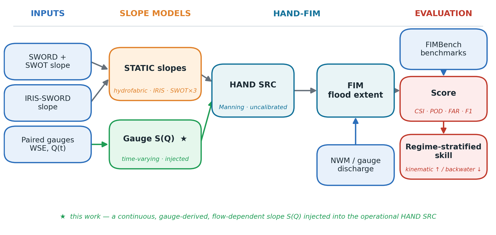
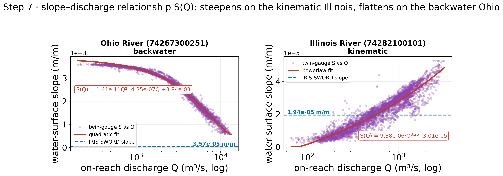
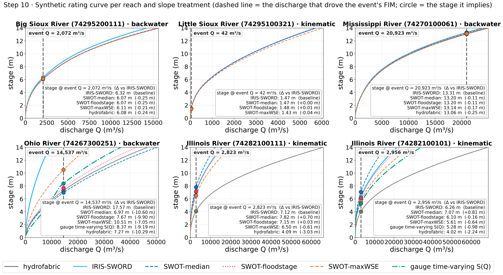

<h1 align="center">TVSlope</h1>
<p align="center"><b>Time-varying river slope in HAND-FIM synthetic rating curves</b></p>
<p align="center">
  
  
  
  
</p>

<p align="center"><i>Does replacing the river slope in operational HAND flood-inundation mapping with a
satellite-derived or a time-varying gauge-derived product measurably change flood-map skill, and where (by
hydraulic regime) does it matter?</i></p>

<p align="center"></p>

---

## Overview

Operational OWP **HAND** flood-inundation mapping (FIM) turns National Water Model (NWM) discharge into flood
extent through a Manning **synthetic rating curve (SRC)**. Because the uncalibrated SRC is Manning
(*Q* &propto; &radic;*S*), the river **slope** *S* is a first-order control on the rating curve. This repository
evaluates, end to end and against the **FIMBench** benchmark, whether a better slope makes a better flood map:
a **static-satellite** baseline (IRIS-SWORD; Chen et al., 2025), three **SWOT**-derived slopes, and a new
**time-varying gauge slope** *S(Q)* fitted from two paired gauges and injected into the rating curve by iterating
*Q* = *Q*<sub>0</sub>&radic;(*S(Q)*/*S*<sub>0</sub>).

**Headline finding.** Across six SWOT-observed reaches, the slope source (and even its flow dependence) is a
**second-order** control on flood extent, while the **hydraulic regime** — free-flowing (kinematic) versus backwater
— is **first-order**: an order-of-magnitude slope range collapses to a few-hundredths range in CSI.

## Notebooks

The first two notebooks are **reach-selection** steps; the last two are the **FIM analysis**.

| Notebook | Scope | What it does |
|---|---|---|
| [`code/gauge_study.ipynb`](code/gauge_study.ipynb) | **Gauges only — not FIM** | A standalone survey of USGS gauge availability across the entire CONUS SWORD network: which reaches carry a same-river upstream/on-reach/downstream gauge triplet that can form a water-surface slope. Independent of flood-inundation mapping and FIMBench. |
| [`code/study_area.ipynb`](code/study_area.ipynb) | **FIM reach selection** | Selects the reaches used in the FIM study: those covered by a **FIMBench** benchmark (**Tier 1–3** or high-water-mark) **and** carrying a usable gauge triplet, so both the benchmark and the paired-gauge slope are available. Benchmarks are auto-downloaded via `fimeval`. |
| [`code/timevary_slope.ipynb`](code/timevary_slope.ipynb) | FIM method | Develops the time-varying gauge *S(Q)* method over the full reach selection: paired-gauge slope vs discharge, iterative Manning injection, HAND-FIM, and River-Mask CSI/F1. |
| [`code/work6_3DHRS.ipynb`](code/work6_3DHRS.ipynb) | FIM headline study | The focused six-reach study and manuscript figures: static-satellite vs gauge time-varying *S(Q)*, scored on the River-Mask domain, with Results & Discussion. |

## Installation

```bash
git clone https://github.com/zixunn/TVSlope.git
cd TVSlope
conda env create -f environment.yml     # base geo-stack: geopandas, rasterio, scipy, matplotlib, dataretrieval, ...
conda activate slope
```

The notebooks also use three HAND-FIM tools from the [SDML lab](https://github.com/sdmlua). Install the ones you
need:

```bash
pip install fimeval        # query + download FIMBench benchmarks  (needed by study_area / timevary)
pip install fimserve       # HAND-FIM staging and serving          (needed to (re)generate FIM)
pip install "git+https://github.com/sdmlua/fimbox"   # HAND-FIM generation (needed to (re)generate FIM)
```

| To do this | You need |
|---|---|
| Reproduce the cached figures (`work6_3DHRS`) | base env only |
| Select reaches / download benchmarks (`gauge_study`, `study_area`) | base env + `fimeval` |
| Regenerate FIM from scratch (`REGEN_FIM=True` / `TVS_REGEN=1`) | base env + `fimeval` + `fimbox` + `fimserve` |

## Quick start

```bash
# reproduce the flagship six-reach study end to end (uses the cached FIM extents)
jupyter nbconvert --to notebook --execute --inplace code/work6_3DHRS.ipynb
```

The core method in a few lines (as inlined in the notebook):

```python
# 1. fit a non-linear slope-discharge relation S(Q) from two paired gauges
fit = fit_sq(discharge_cms, water_surface_slope)          # power-law or quadratic, whichever fits better
# 2. inject it into every HAND hydro-table row by iterating Q = Q0 * sqrt(S(Q)/S0)
Q_new, S_new = solve_Q(Q0, S0, fit["func"])               # a time-varying synthetic rating curve
# 3. run FIMbox to a flood extent and score it against FIMBench on the river-mask domain
csi = score_rm(fim_tif, benchmark_tif, river_mask(aoi, reach))["CSI"]
```

Running `work6_3DHRS.ipynb` writes every figure into [`output_final/`](output_final/), for example:

<p align="center">
  
  
</p>

## Method &amp; workflow

```
reach selection            slope treatments              HAND-FIM + scoring
──────────────────         ─────────────────────         ────────────────────────────
SWORD ∩ FIMBench       →   hydrofabric (reference)   →   inject slope into the SRC
same-river gauge           IRIS-SWORD (baseline)         (Manning rescale / iterative S(Q))
triplets                   SWOT median/floodstage/           │
(gauge_study,              maxWSE                        NWM forcing: retrospective in-window,
 study_area)               gauge time-varying S(Q)           operational forecast post-2023
                              (this work)                    │
                                                         score vs FIMBench on the RIVER MASK
                                                         (reach NWM catchments; largest CC)
                                                             │
                                                         CSI · F1 · POD · FAR  →  regime analysis
```

Two choices make the comparison defensible: **(1)** every event is forced by one NWM family (retrospective, or the
operational short-range forecast for post-2023 floods — never a substituted gauge); **(2)** every metric is computed
on the **river mask** (the union of the reach's NWM catchments, benchmark cleaned to its largest connected
component), removing the large off-channel false-negative term that a whole-benchmark score would impose.

## Data

The repository commits only the small derived tables that cannot be queried from a public service; everything else
is downloaded or generated by the workflow (full manifest, sizes, and sources in [`DATA.md`](DATA.md)).

| Committed here (`data/`) | Fetched / generated by the workflow |
|---|---|
| `FIMHF_IRIS_new.csv`, `FIMHF_IRIS_v1.0.csv` — IRIS-SWORD satellite slopes (Chen et al., 2025) | **FIMBench** benchmarks — auto-downloaded via `fimeval` |
| `slope_treatments.csv` — SWOT-derived slope products per reach | **USGS** stage/discharge — auto-fetched via `dataretrieval` |
| `study_area_gauges.csv` — same-river gauge triplets | **SWORD** reach network — downloaded from the SWORD data portal |
|  | **NWM** discharge and the staged **HAND** cache — generated by `fimbox` / `fimserve` |

## Examples

<table>
<tr>
<td width="50%"><br><sub><b>Six study reaches</b> — SWOT reach, FIMBench flood extent, river-mask evaluation domain.</sub></td>
<td width="50%"><br><sub><b>Flood-map skill (CSI, F1)</b> by slope treatment on the river-mask domain.</sub></td>
</tr>
</table>

## Citation

If you use this code or the derived slope products, please cite this repository and the IRIS-SWORD source
(Chen et al., 2025).

## Acknowledgements

Built on the OWP HAND-FIM chain and FIMBench, the [SDML lab](https://github.com/sdmlua) `fimeval` / `fimbox` /
`fimserve` tools, the SWORD river database, the SWOT and ICESat-2/IRIS water-surface products, and the National
Water Model.
