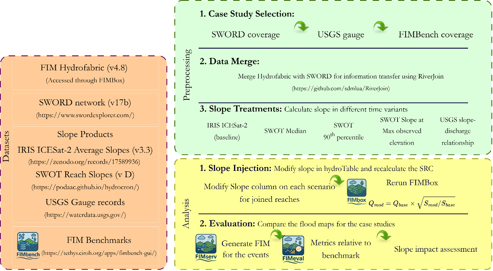
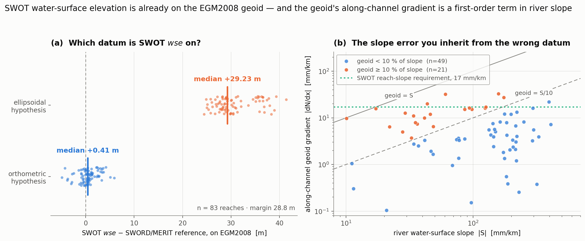

<div align="center">

  # Evaluating the Sensitivity of HAND Flood Inundation Mapping to River Slope

### Innovation in Flood Inundation Mapping for Operational Forecasting

**CUAHSI Summer Institute 2026** · 


The uncalibrated NOAA-OWP HAND synthetic rating curve is Manning (`Q ∝ √S`), so the river **slope** `S` is an
important control on the mapped flood extent. This repository asks whether replacing that slope with a
static-satellite product (IRIS-SWORD, SWOT) or a **time-varying gauge-derived `S(Q)`** measurably changes HAND-FIM
skill, and where (by hydraulic regime) it matters.

</div>

<p align="center"></p>

---

## Overview

Operational OWP **HAND** flood-inundation mapping (FIM) turns National Water Model (NWM) discharge into flood
extent through a Manning **synthetic rating curve (SRC)**. Because the uncalibrated SRC is Manning
(*Q* &propto; &radic;*S*), the river **slope** *S* is a first-order control on the rating curve. This repository
evaluates, end to end and against the **FIMBench** benchmark, whether a better slope makes a better flood map:
a **static-satellite** baseline (IRIS-SWORD; Chen et al., 2025), three **SWOT**-derived slopes, and a new
**time-varying gauge slope** *S(Q)* fitted from two paired gauges and injected into the rating curve by iterating
*Q* = *Q*<sub>0</sub>&radic;(*S(Q)*/*S*<sub>0</sub>).

**Headline finding.** Across six SWOT-observed reaches, the slope source (and even its flow dependence) is a
**second-order** control on flood extent, while the **hydraulic regime** — free-flowing (kinematic) versus backwater
— is **first-order**: an order-of-magnitude slope range collapses to a few-hundredths range in CSI.

## What's here

Everything executable lives under `code/`. The notebooks are numbered in the order they are meant
to be run, and every Python module sits under the single `code/tvslope_src/` tree.

```
code/
  01_gauge_study.ipynb         CONUS-wide gauge-availability survey (gauges only, not FIM)
  02_study_area.ipynb          FIM reach selection (FIMBench coverage + gauge triplets)
  03_swot_geoid_slope.ipynb    vertical-datum QC: which datum each height source is on
  04_timevary_slope.ipynb      the time-varying gauge S(Q) method over the full reach selection
  05_work6_3DHRS.ipynb         the focused six-reach study and manuscript figures
  06_TV_Slope_FIM.ipynb        the consolidated study, end to end  (run this one)
  get_data.py                  downloads the large datasets that are not provided (FIMBench, SWORD)
  tvslope_src/
    engine/                    the analysis modules: datum, study config, slope treatments, S(Q),
                               benchmark gate, causal footprint, scoring, figures
    fimbox_ext/                the FIMbox-wrapping drivers: build HAND + generate the FIM
data/                          small derived data
output_final/                  figures and tables written by the notebooks
```

> Numbers 01–02 select the reaches, 03 checks the vertical datums the later steps depend on, 04–06 are
> the FIM analysis, and 07 is an independent second reading of the same question.

## Notebooks

| # | Notebook | Scope | What it does |
|---|---|---|---|
| 01 | [`code/01_gauge_study.ipynb`](code/01_gauge_study.ipynb) | **Gauges only — not FIM** | A standalone survey of USGS gauge availability across the entire CONUS SWORD network: which reaches carry a same-river upstream/on-reach/downstream gauge triplet that can form a water-surface slope. Independent of flood-inundation mapping and FIMBench. |
| 02 | [`code/02_study_area.ipynb`](code/02_study_area.ipynb) | **FIM reach selection** | Selects the reaches used in the FIM study: those covered by a **FIMBench** benchmark (**Tier 1–3** or high-water-mark) **and** carrying a usable gauge triplet, so both the benchmark and the paired-gauge slope are available. Benchmarks are auto-downloaded via `fimeval`. |
| 03 | [`code/03_swot_geoid_slope.ipynb`](code/03_swot_geoid_slope.ipynb) | **Vertical datum** | Establishes which vertical datum every height source is on before any slope is computed from it, and quantifies what the choice costs. See [Vertical datum](#vertical-datum-swot-wse-and-the-geoid). |
| 04 | [`code/04_timevary_slope.ipynb`](code/04_timevary_slope.ipynb) | FIM method | Develops the time-varying gauge *S(Q)* method over the full reach selection: paired-gauge slope vs discharge, iterative Manning injection, HAND-FIM, and River-Mask CSI/F1. |
| 05 | [`code/05_work6_3DHRS.ipynb`](code/05_work6_3DHRS.ipynb) | FIM headline study | The focused six-reach study and manuscript figures: static-satellite vs gauge time-varying *S(Q)*, scored on the River-Mask domain, with Results & Discussion. |
| 06 | [`code/06_TV_Slope_FIM.ipynb`](code/06_TV_Slope_FIM.ipynb) | Consolidated study | Runs the whole study end to end over the six reaches and scores every slope treatment against FIMBench. |

## Installation

```bash
git clone https://github.com/NWC-CUAHSI-Summer-Institute/TVSlope.git
cd TVSlope
conda env create -f environment.yml     # base geo-stack: geopandas, rasterio, pyproj, scipy, matplotlib, ...
conda activate slope
python code/get_data.py                 # FIMBench + SWORD (large; not in the repo)
```

The notebooks also use three HAND-FIM tools from the [SDML lab](https://github.com/sdmlua). Install the ones you
need:

```bash
pip install fimeval        # query + download FIMBench benchmarks  (needed by study_area / timevary)
pip install fimserve       # HAND-FIM staging and serving          (needed to (re)generate FIM)
pip install "git+https://github.com/sdmlua/fimbox"   # HAND-FIM generation (needed to (re)generate FIM)
```

| To do this | You need |
|---|---|
| Reproduce the cached figures (`05_work6_3DHRS`) | base env only |
| Run the vertical-datum QC (`03_swot_geoid_slope`) | base env only (downloads geoid grids on first use) |
| Select reaches / download benchmarks (`01_gauge_study`, `02_study_area`) | base env + `fimeval` |
| Regenerate FIM from scratch (`REGEN_FIM=True` / `TVS_REGEN=1`) | base env + `fimeval` + `fimbox` + `fimserve` |

## Quick start

```bash
# reproduce the flagship six-reach study end to end (uses the cached FIM extents)
jupyter nbconvert --to notebook --execute --inplace code/05_work6_3DHRS.ipynb
```

The core method in a few lines (as inlined in the notebook):

```python
# 1. fit a non-linear slope-discharge relation S(Q) from two paired gauges
fit = fit_sq(discharge_cms, water_surface_slope)          # power-law or quadratic, whichever fits better
# 2. inject it into every HAND hydro-table row by iterating Q = Q0 * sqrt(S(Q)/S0)
Q_new, S_new = solve_Q(Q0, S0, fit["func"])               # a time-varying synthetic rating curve
# 3. run FIMbox to a flood extent and score it against FIMBench on the river-mask domain
csi = score_rm(fim_tif, benchmark_tif, river_mask(aoi, reach))["CSI"]
```

Running `05_work6_3DHRS.ipynb` writes every figure into [`output_final/`](output_final/), for example:

<p align="center">
  
  
</p>

## Method &amp; workflow



Three choices make the comparison defensible:

**(1)** every event is forced by one NWM family (retrospective, or the operational short-range forecast for
post-2023 floods — never a substituted gauge);

**(2)** every metric is computed on the **river mask** — the union of the reach's NWM catchments, with
benchmark water that is not connected to the riverline dropped — removing the large off-channel term a
whole-benchmark score would impose. `engine/reach_mask.py` adds the invariant that follows from this: if the
flood map changes *outside* the catchments the injection touched, the injection touched something it should
not have. That is a correctness test, not a metric, and it has caught a real bug.

**(3)** **permanent water is excluded from scoring.** FIMBench benchmarks are *observed-water* maps, so they
contain the river sitting in its own channel, and the channel is not a flood. The operational `fimeval`
scorer gives permanent water its own class and excludes it; this pipeline previously did not.
`score_rm(..., exclude_permanent_water=True)` now drops those pixels from the domain entirely.

It matters, and by more than expected — measured in
[`output_final/tables/permanent_water_effect.csv`](output_final/tables/permanent_water_effect.csv):

| Reach | CSI before | CSI after | ΔCSI | benchmark-wet that was channel |
|---|---:|---:|---:|---:|
| 74282100101 Illinois | 0.624 | 0.555 | −0.069 | 23.9 % |
| 74282100111 Illinois | 0.604 | 0.477 | −0.127 | 30.3 % |
| **74267300251 Ohio** | 0.349 | 0.117 | **−0.232** | **54.3 %** |
| 74295200111 Big Sioux | 0.351 | 0.347 | −0.004 | 1.2 % |

On the Ohio **more than half** of everything the benchmark calls wet is permanent channel. Note the sign:
CSI *falls* when the channel is removed, and POD falls with it (Ohio 0.68 → 0.36), so the channel was
scoring as **true positive** — the model did wet it — and was inflating every treatment with easy,
slope-insensitive agreement. That is the same reason the river mask exists: it is ground the slope treatment
cannot move, so it does not belong in a metric meant to separate treatments.

And it does sharpen the comparison, which is the point. Per treatment on Illinois reach 74282100101
([`permanent_water_by_treatment.csv`](output_final/tables/permanent_water_by_treatment.csv), domain −15.6 %):

| Treatment | CSI before | CSI after | ΔCSI |
|---|---:|---:|---:|
| hfirissword_new | 0.6247 | 0.5598 | −0.065 |
| swot_maxwse | 0.6243 | 0.5553 | −0.069 |
| gauge_median | 0.6223 | 0.5573 | −0.065 |
| swot_median | 0.6166 | 0.5538 | −0.063 |
| swot_floodstage | 0.5887 | 0.5137 | −0.075 |
| *baseline* | *0.4374* | *0.3235* | *−0.114* |

The **baseline loses most** (−0.114 against −0.063…−0.075), so every treatment's margin over it grows, and
the spread among the treatments widens from **0.036 to 0.046** — a 28 % gain in separation. The ranking is
otherwise stable; the only change is `swot_maxwse` and `gauge_median` swapping across a 0.002 near-tie.

**These CSIs are lower than the previously published ones, and they measure floodplain skill.**

## Vertical datum: SWOT WSE and the geoid

A slope is a difference of heights over a distance, so a **constant** offset between vertical datums cancels
and the datum looks like bookkeeping. The **gradient** of the datum separation does not cancel — and on these
reaches it is the same order of magnitude as the river slope itself. [`code/03_swot_geoid_slope.ipynb`](code/03_swot_geoid_slope.ipynb)
works this out; [`code/tvslope_src/engine/datum.py`](code/tvslope_src/engine/datum.py) is the module.

<p align="center"></p>

**1 · SWOT WSE is already on the geoid — do not "convert" it.** SWOT L2_HR_RiverSP delivers `wse` referenced
to **EGM2008**, not to the WGS84 ellipsoid. We test this rather than quote it: scored against SWORD/MERIT
(moved onto EGM2008 first), treating `wse` as orthometric leaves a median residual of **+0.41 m**, while
treating it as ellipsoidal leaves **+29.23 m**. Subtracting a geoid undulation from `wse` is therefore a
**~30 m blunder**, not a refinement. `datum.SWOT_WSE_DATUM` records the datum and `verify_swot_datum()`
re-checks it on any new pull.

**2 · The geoid's along-channel gradient is a first-order slope term.** Writing a slope from ellipsoidal
heights, `dh/dx = dH/dx + dN/dx` — the river slope you want, plus a geoid gradient you did not ask for.
Over the 92 SWOT-observed study reaches (median length 10.0 km):

| Quantity | median | p90 | max |
|---|---:|---:|---:|
| along-channel geoid gradient &#124;dN/dx&#124; (EGM2008) | 4.1 mm/km | 16.2 | **32.9** |
| EGM2008 − EGM96 slope difference | 1.2 mm/km | 6.2 | **13.0** |
| river water-surface slope &#124;S&#124; *(70 reaches above 10 mm/km)* | 135 mm/km | 255 | 409 |

On **21 of those 70** reaches the geoid gradient is worth more than 10 % of the river slope, on **3** more than
half, and on **8 of 92** it exceeds **17 mm/km** — SWOT's own reach-slope accuracy requirement — all by itself.
A worked example in the notebook (Arkansas River, 10.8 km) computes the same reach at 158 mm/km on EGM96 and
134 mm/km on the ellipsoid: a **24 mm/km**, ~15 % error. Since the uncalibrated SRC is Manning (*Q* &propto; &radic;*S*),
a 10 % slope error moves discharge ~5 % at fixed stage — and it does so with a spatial pattern that looks like
real topography, which is exactly the kind of error that survives visual inspection. **A slope computed on the
wrong datum mimics the geoid, not the river bed.**

**3 · The datasets here do not share a datum.** SWOT `wse` is **EGM2008**, SWORD/MERIT Hydro `wse` is
**EGM96**, IRIS is **EIGEN-6C4**, and USGS gauge `alt_va` is **NAVD88 *or* NGVD29**, per station. Differencing
across two datums injects the difference between them into the slope. `datum.convert_vertical()` puts every
source on one datum first.

**4 · The same problem, on the ground: the gauge pairs were mixing datums.** The time-varying gauge slope is
`S = (WSE_up − WSE_dn) / span` with `WSE = alt_va + stage`. NWIS reports `alt_va` against whatever
`alt_datum_cd` says, and the original code read `alt_va` while ignoring that code. Of the study's 88 gauges,
**79 are NAVD88, 6 are NGVD29 and 3 report none** — and **7 of 78 twin-gauge pairs straddle two datums**, so
the NGVD29↔NAVD88 offset was going straight into their slope.

`engine/per_reach3.py` now converts every gauge onto one datum (`datum.GAUGE_REF_DATUM`, NAVD88) before
building `wse_series`, and returns NaN for a gauge on a `LOCAL`/`ASSUMED` datum instead of a number that
quietly poisons the pair. Removing the artefact changes those 7 pairs by a median **5.5 mm/km** and up to
**47.3 mm/km**. Because the artefact is a fixed offset in metres, it is negligible on a steep reach and
dominant on a flat one — worst case reach `74267300241` (Ohio River, 18.5 km) drops from **14.35 to
6.42 mm/km**, i.e. the old value was **more than double** the true slope. That is the backwater regime this
study finds to be first-order, so the fix bites exactly where it matters most.

This is now the only gauge chain in the repository: the parallel tree that carried the unharmonised
version has been merged in and removed.

## Data

The repository commits only the small derived tables that cannot be queried from a public service; everything else
is downloaded or generated by the workflow (full manifest, sizes, and sources in [`DATA.md`](DATA.md)).

**Provided in `data/`**

| File | What it is | Provenance |
| --- | --- | --- |
| `data/slope_treatments.csv` | Per-reach slope for each treatment (hydrofabric, IRIS-SWORD, SWOT median/floodstage/maxWSE) | Derived in this study |
| `data/FIMHF_IRIS_new.csv`, `data/FIMHF_IRIS_v1.0.csv` | IRIS-SWORD static slope | Built from **IRIS v3.3** + **SWORD v17b**, following Chen et al. (2025) |
| `data/paired_reach_SWOT_gage/gauge_latlon.csv` | USGS gauge coordinates (id, name, lat, lon) | USGS NWIS |
| `data/study_area_gauges.csv` | Same-river upstream/on-reach/downstream gauge triplets per reach | Derived in this study |
| `data/fimbox_bankfull_2yr_cms.parquet` | 2-year recurrence (bankfull) discharge per NWM feature_id | NWM recurrence flows |
| `data/us_states.gpkg` | US state boundaries for the CONUS map | Public US state boundaries |
| `data/swot_hydrocron_study_reaches.csv` | SWOT L2_HR_RiverSP reach observations (WSE, slope, width, quality) for the study reaches | **Hydrocron** API (PO.DAAC) |
| `data/swot_study_reach_nodes.csv` | SWORD node chain (coordinates, `dist_out`, WSE) for those reaches — lets the datum notebook run without the 3.7 GB SWORD download | **SWORD v17b** |
| `data/swot_study_reaches_sword.csv` | SWORD reach centroids, WSE and slope for those reaches | **SWORD v17b** |
| `data/study_gauge_datums.csv` | Every study gauge's `alt_va`, its reported `alt_datum_cd`, and the elevation converted onto NAVD88 | USGS NWIS + PROJ VERTCON |

**Fetched by code — run `python code/get_data.py`.**

| Data | How to get it | Source |
| --- | --- | --- |
| FIMBench benchmark flood maps (`data/FIMBench/`) | `python code/get_data.py` (uses `fimeval`) | **FIMbench** (https://tethys.ciroh.org/apps/fimbench-gui/) |
| SWORD v17b river network (`data/SWORD_v17b_gpkg/na_sword_reaches_v17b.gpkg`) | `python code/get_data.py` | **SWORD v17** (https://zenodo.org/records/15299138) |
| USGS gauge discharge & stage (`data/discharge/`, `data/twin_gauge/`) | cached on the first notebook run (`dataretrieval`) | USGS NWIS |
| NWM hydrofabric + 3DEP DEM + staged HAND (`data/fimbox_out/`) | Rebuilt by the notebook when `REGEN_FIM=1` (needs `fimbox`) | NWM / USGS 3DEP, via FIMbox |

## Examples

<table>
<tr>
<td width="50%"><br><sub><b>Six study reaches</b> — SWOT reach, FIMBench flood extent, river-mask evaluation domain.</sub></td>
<td width="50%"><br><sub><b>Flood-map skill (CSI, F1)</b> by slope treatment on the river-mask domain.</sub></td>
</tr>
</table>

## Citations

- **IRIS v3.3** (ICESat-2 River Surface Slope) — Scherer, D., Schwatke, C., Dettmering, D., & Seitz, F. (2022).
  ICESat-2 based River Surface Slope and Its Impact on Water Level Time Series From Satellite Altimetry.
  *Water Resources Research.* https://doi.org/10.1029/2022WR032842 · data: https://zenodo.org/records/14616464
- **SWORD v17b** (SWOT River Database) — Elizabeth H. Altenau, Tamlin M. Pavelsky, Michael T. Durand, Xiao Yang, Renato P. d. M. Frasson & Liam Bendezu. (2025). SWOT River Database (SWORD) (Version v17b) [Dataset]. Zenodo. https://doi.org/10.5281/zenodo.15299138 · data: https://zenodo.org/records/15299138 · https://www.swordexplorer.com/
- **IRIS-SWORD slope** — Chen, Y., Cohen, S., Baruah, A., Devi, D., Dhital, S., Tian, D., & Munasinghe, D. (2025). Merging Remote Sensing Derived River Slope Datasets with High-Resolution Hydrofabrics for the United States. *Scientific Data*, 12(1), 1657.
- **EGM2008** — Pavlis, N. K., Holmes, S. A., Kenyon, S. C., & Factor, J. K. (2012). The development and evaluation of the Earth Gravitational Model 2008 (EGM2008). *Journal of Geophysical Research: Solid Earth*, 117(B4).
- **National Water Model** (retrospective + operational short-range forecast) — NOAA Office of Water Prediction.
- **USGS** gauge data and **3DEP** 10 m DEM — U.S. Geological Survey.
- **FIMBench** benchmark flood maps — Surface Dynamics Modeling Lab, University of Alabama.

## Code and copyright

| Path | Origin | What we changed |
| --- | --- | --- |
| `code/tvslope_src/engine/*.py` | Our own code | Written for this study. `timevarying_slope.py` adapts the TimeVariantSlope `S(Q)` method; `fim_reach.py` and `fim_eval.py` reimplement the RiverJoin river-matching and FIMeval scoring concepts. |
| `code/tvslope_src/fimbox_ext/*.py` | **Built on FIMbox** ([github.com/sdmlua/fimbox](https://github.com/sdmlua/fimbox)) | We modified the code from FIMbox: observation-calibration disabled, per-treatment slope injection, a branch-0 tributary gap-filler, and NWM-forecast forcing. Each file carries a `Built on FIMbox` header noting the source and the change. |

### Source tools and licenses

| Tool | Owner | License | Repository |
| --- | --- | --- | --- |
| FIMbox | Surface Dynamics Modeling Lab (Univ. of Alabama) | GPL-3.0 | https://github.com/sdmlua/fimbox |
| FIMserv | SDML | see repo | https://github.com/sdmlua/FIMserv |
| FIMeval | SDML | see repo | https://github.com/sdmlua/fimeval |
| FIMbench | SDML | see repo | https://github.com/sdmlua/fimbench |
| RiverJoin | SDML | see repo | https://github.com/sdmlua/riverjoin_py |
| NOAA-OWP/inundation-mapping | NOAA Office of Water Prediction | see repo | https://github.com/NOAA-OWP/inundation-mapping |

> **License note.** FIMbox is **GPL-3.0**. Because the drivers in `code/tvslope_src/fimbox_ext/` build on FIMbox,
> they are likewise distributed under **GPL-3.0**. Add a top-level `LICENSE` file before publishing more widely.

---

## Team

| Name | Institution | GitHub |
|---|---|---|
| Zih-Syun Chen | University of Houston | [@zixunn](https://github.com/zixunn) |
| Sebastian Marshall | Johns Hopkins University | [@rushmarshall](https://github.com/rushmarshall) |
| Pitamber Wagle | Brigham Young University | [@Pitamberwagle](https://github.com/Pitamberwagle) |
| Reza Jamshidi | Northeastern University | [@Reza-Jamshidi](https://github.com/Reza-Jamshidi) |

**Theme leads:** Sagy Cohen and Anupal Baruah, University of Alabama

## Acknowledgements

Built on the OWP HAND-FIM chain and FIMBench, the [SDML lab](https://github.com/sdmlua) `fimeval` / `fimbox` /
`fimserve` tools, the SWORD river database, the SWOT and ICESat-2/IRIS water-surface products, and the National
Water Model.

---
<div align="center">

**CUAHSI Summer Institute 2026** &nbsp;·&nbsp; **Team Slippery Slope**

University of Houston &nbsp;·&nbsp; Johns Hopkins University &nbsp;·&nbsp; Brigham Young University &nbsp;·&nbsp; Northeastern University 

</div>
